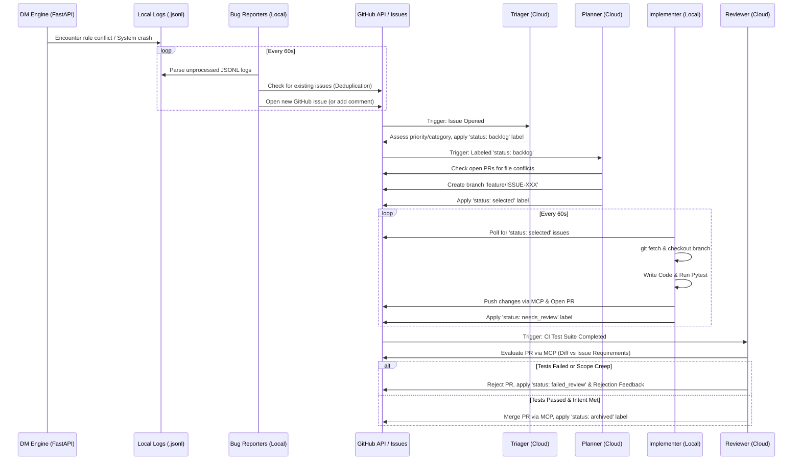

# AI QA & Project Management Architecture

## 1. Purpose
The purpose of this architecture is to provide a fully autonomous, event-driven, self-healing developer team for the D&D Rules Engine. By decoupling bug detection, triage, planning, implementation, and review into specialized AI agents, the system can continuously monitor itself, write its own code fixes, run local test suites, and merge passing code into the repository with zero human intervention.

This pipeline utilizes a **Hybrid Local/Cloud Architecture** and relies natively on **GitHub Issues and Pull Requests** as its central state manager and event bus, entirely avoiding local file-locking collisions.

---

## 2. Architecture Overview
The team is divided between **Local Daemons** (which require access to local file systems, continuous monitoring, and the ability to run local `pytest` executions) and **Cloud Actions** (which run ephemerally on GitHub Actions to save compute, trigger strictly on webhooks, and manage repository state).

*   **Central State Store:** GitHub Issues (Kanban Board) & GitHub Pull Requests (Code Staging).
*   **Remote Execution:** The official GitHub Model Context Protocol (MCP) server is used to securely allow agents to read/write repository files without checking them out locally, preventing `index.lock` collisions.
*   **Local Execution:** Shell commands (`subprocess`) are used by the Implementer to physically check out branches and run local CI/CD tests before committing.

---

## 3. Sequence Diagram & Process Flow

---

## 4. Overview of Each Agent

### 4.1. Bug Reporters & System Monitor (Local Daemon)
*   **Location:** `qa/bug_reporters.py`
*   **Trigger:** `while True` loop (every 60 seconds) & UDP Socket Listener.
*   **Role:** The observers. 
    *   **Rules Agent:** Scans `logs/qa_audits` for gameplay rule disputes caught by the DM Engine's QA node or player challenges. Validates them against web searches.
    *   **System Agent:** Scans `logs/active` for unhandled Python exceptions and API crashes.
    *   **Monitor Agent:** Listens on `127.0.0.1:9999` for OS-level CPU/RAM telemetry from the FastAPI server. Alerts on resource spikes or silent process deaths.
*   **Output:** Creates or comments on native GitHub Issues using `PyGithub`.

### 4.2. The Triager (Cloud Action)
*   **Location:** `qa/triager_agent.py` (`.github/workflows/ai_triager.yml`)
*   **Trigger:** GitHub Event `issues: [opened]`
*   **Role:** The dispatcher. Reads new issues, determines severity, and categorizes the problem (e.g., is it a narrative issue or a core rules issue?). 
*   **Output:** Applies GitHub labels (e.g., `priority: high`, `category: rules`, `status: backlog`).

### 4.3. The Planner (Cloud Action)
*   **Location:** `qa/planner_agent.py` (`.github/workflows/ai_planner.yml`)
*   **Trigger:** GitHub Event `issues: [labeled]` (specifically `status: backlog`).
*   **Role:** The Project Manager. Prevents git conflicts by reading the issue, predicting which Python files need modification, and checking if any open PRs are currently touching those files. If clear, it creates a dedicated feature branch.
*   **Output:** Creates branch `feature/ISSUE-[NUMBER]` and labels the issue `status: selected`.

### 4.4. The Implementer (Local Daemon)
*   **Location:** `qa/dev_pipeline.py`
*   **Trigger:** `while True` loop checking for `status: selected` issues.
*   **Role:** The Coder. The only agent that writes code locally. It checks out the branch, writes the logic, and vigorously runs `pytest test/server/` to ensure it hasn't broken the engine.
*   **Output:** Pushes passing code to GitHub via the MCP Server, opens a Pull Request, and labels the issue `status: needs_review`.

### 4.5. The Reviewer (Cloud Action)
*   **Location:** `qa/reviewer_agent.py` (`.github/workflows/ai_reviewer.yml`)
*   **Trigger:** GitHub Event `workflow_run` (Triggered when the CI test suite finishes running on a PR).
*   **Role:** The Gatekeeper. Validates that the code in the PR matches the scope of the original issue without hallucinating extra features. Resolves merge conflicts natively via the MCP server if necessary.
*   **Output:** Merges the PR into `main` and labels the issue `status: archived`, OR rejects it, provides feedback, and loops it back to `status: backlog`.

---

## 5. GitHub Issue Standards & Appendix

The architecture completely eschews local Markdown files in favor of native GitHub Issues. To maintain strict programmatic consistency, the agents expect Issues and Labels to follow these standards.

### Expected Issue Body Format
When the **Bug Reporters** create an issue, it must strictly contain:
1.  **High-Resolution Timestamp:** For tracking race conditions.
2.  **Agent ID / Player Name:** Who reported it.
3.  **Error Message / Stack Trace:** The literal Python exception or the rule dispute details.
4.  **JSON Context Block:** The full `context` payload dumped by the system logger, including vault state, character names, and active configurations.

### Deduplication Standard
Agents **must not** open duplicate issues for the same recurring bug. 
Before creating an issue, the Bug Reporter searches open issues. If a match is found, it adds a *Comment* with the new timestamp and context block. The Triager tracks frequency by assessing comment density.

### Expected Label Ontology
The system relies heavily on GitHub Labels to trigger workflows. 

**1. State Pipeline (Status)**
*   *(No Label)* -> Issue just opened. Waiting for Triager.
*   `status: backlog` -> Triaged. Waiting for Planner.
*   `status: selected` -> Branch created. Waiting for Implementer to code.
*   `status: needs_review` -> PR open. Waiting for CI & Reviewer.
*   `status: failed_review` -> Rejected by Reviewer. Needs Implementer rework.
*   `status: archived` -> Merged successfully. Closed.
*   `status: needs_human` -> Agent encountered an unresolvable merge conflict or architectural blockage.

**2. Priority**
*   `priority: critical` -> Engine crashed or memory leak detected.
*   `priority: high` -> Core rule broken (e.g., damage calculation wrong).
*   `priority: medium` -> Standard mechanic failure.
*   `priority: low` -> Minor formatting or narrative discrepancy.

**3. Category**
*   `category: rules` -> Handled via `dnd_rules_engine.py` or `tools.py`.
*   `category: narrative` -> Handled via `prompts.py` or State schemas.
*   `category: code` -> API failures, middleware, spatial engine math.
*   `category: system` -> Hardware / UDP Heartbeat alerts.